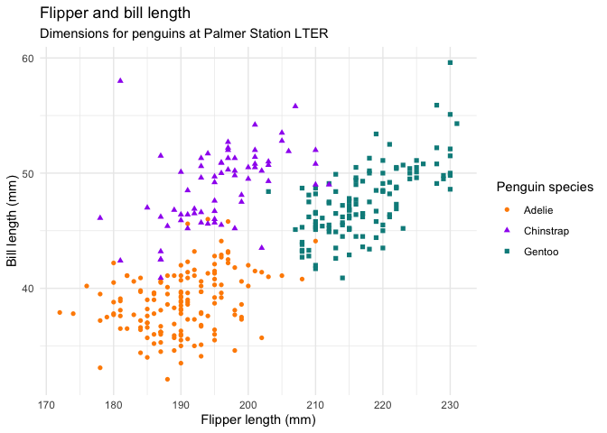

# play
Nat Forde
2024-10-09

# Playtime with markdown

Just *playing* with **types** of ***font***

how about *these*

`blahblah`

~~doubletime~~

\[\] did I get it?

## I’m new to quarto

# Let’s see what it can do

## Meet Quarto

Quarto enables you to weave together content and executable code into a
finished document. To learn more about Quarto see <https://quarto.org>.

## Meet the penguins

The `penguins` data from the
[**palmerpenguins**](https://allisonhorst.github.io/palmerpenguins "palmerpenguins R package")
package contains size measurements for 344 penguins from three species
observed on three islands in the Palmer Archipelago, Antarctica.

The plot below shows the relationship between flipper and bill lengths
of these penguins.

